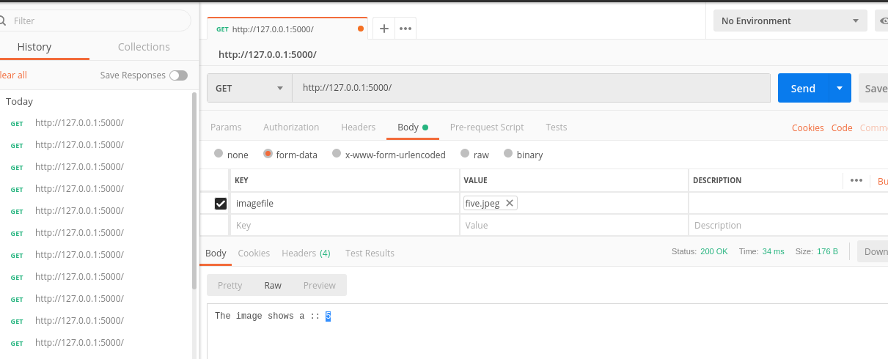

# Convolutional-Neural-Networks-Application-SIGN-dataset-
This repository showcases the use case of image classification on SIGN dataset with 6 classes. The dataset contains hand signs. The model used has CONV2D -> RELU -> MAXPOOL -> CONV2D -> RELU -> MAXPOOL -> FLATTEN -> FULLYCONNECTED layers.
Implementation is done in pytorch. The model achieves an accuracy of 99% on train data and 91% on the test data. 
I had implemented a flask API for this application which takes an image as input and outputs the image prediction. 

